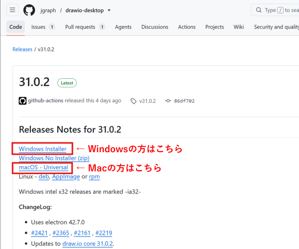
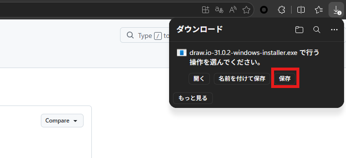
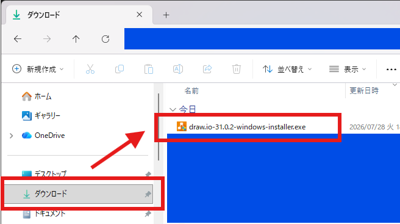
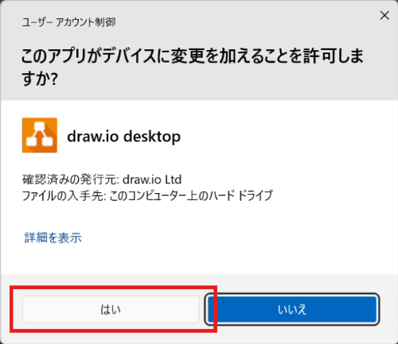
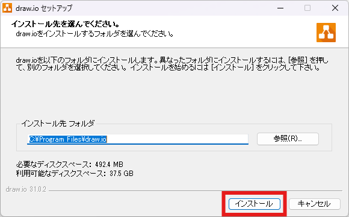
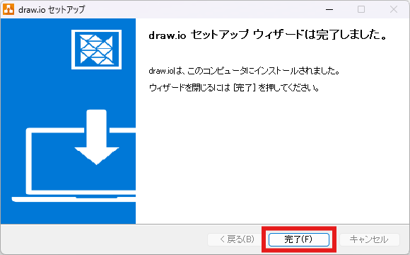
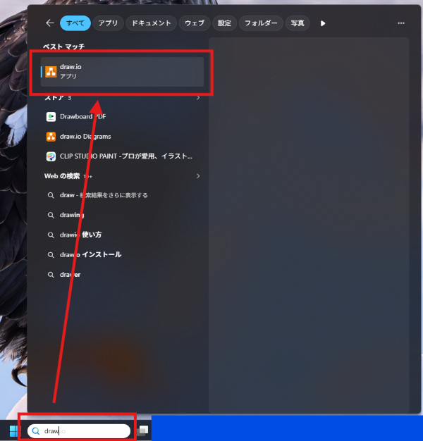

# draw.ioアプリのインストール

## インストール手順

1. [インストールページ](https://github.com/jgraph/drawio-desktop/releases/tag/v31.0.2)にアクセスします。

1. インストーラーのダウンロードリンクをクリックします。
    - ご利用のPCに応じたダウンロードリンクをクリックしてください。
    - 以降はWindowsの場合の手順です。Macをご利用の方は、適宜読み替えて実施してください。  

1. ダウンロードの確認が表示された場合は、「保存」を選択します。  

1. 保存されたら、エクスプローラーを開き、「ダウンロード」からインストーラーを開きます。  

1. 以下のような確認が表示された場合は、「はい」を選択します。  

1. 案内に従って、インストールを実行します。  

1. インストールが完了したら、「完了」を選択して閉じます。  

1. PCの検索窓より「draw」と入力し、「draw.io」がインストールされていることを確認できれば、インストール完了です。  

