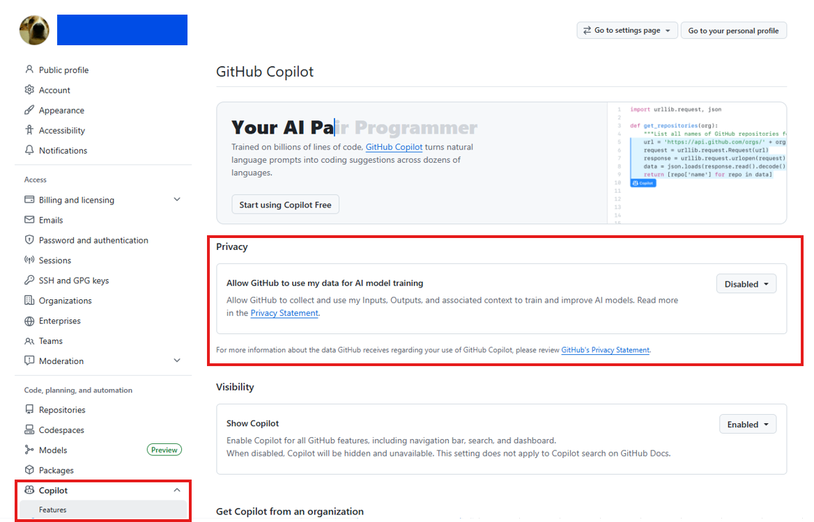

# GitHubのアカウント作成

## アカウント作成
下記サイトを参考に、**GitHubの無料アカウント作成**を行って下さい。

GitHubでは自分が作成・管理するソースコードを一般に公開することができます。  
システムエンジニアにとってGitHubアカウントは、扱える技術の幅やレベル、自己研鑽の度合いなどを具体的に伝える名刺のようなものです。  
本イベント以外でも今後使用する場面が出てくると思われます。アカウントの命名は慎重に行うことをおすすめします。
  
例年、登録したユーザー名/パスワードを忘れてしまう方がいらっしゃいます。  
イベント当日に思い出せるよう必要に応じてメモをとるなどの対応をしてください。

**[GitHub アカウントの作成方法](https://docs.github.com/ja/get-started/start-your-journey/creating-an-account-on-github#signing-up-for-a-new-personal-account)**  
※ Gitのインストールは不要です。

## GitHub Copilotの設定確認

デフォルト設定では、 **生成AIツールの操作履歴等がAIモデルの学習に利用**されます。  
そこで、明示的に設定の無効化を行います。  

以下リンクより自身の設定画面に遷移し、画像のように `Disabled` に変更してください。  
https://github.com/settings/copilot/features  
※Copilot Business (有料組織)アカウントをお持ちの場合は、そもそも学習が許可されていないため対応不要です。  

