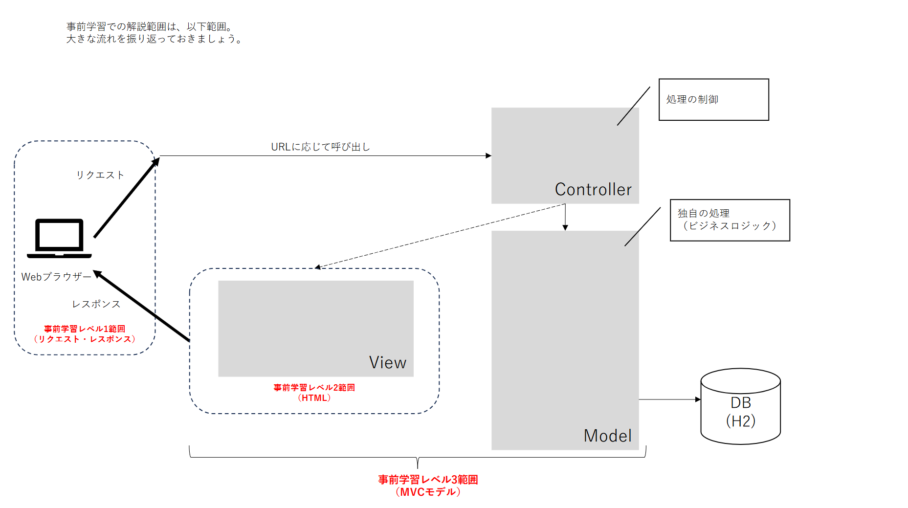
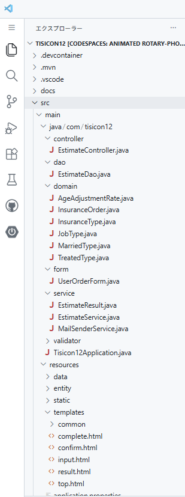
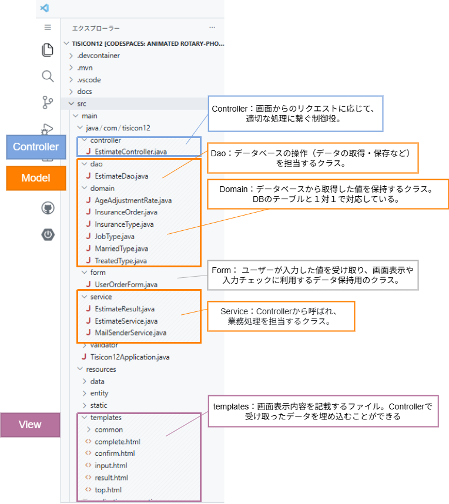

# Webアプリケーションの基礎知識

## 学習の目的

事前に「Webアプリケーションの基礎知識」を学ぶことで、**必要な知識を身につけ、イベントをより充実したものにしていきましょう。**  

皆さんがこれからIT業界に携わるのであれば、本イベント以外でも長く役立つ知識になるはずです。  
ぜひ前向きに取り組んでください。

## 学習方法

- まずは流れをつかむことを重視する
   - 最低限の単語は押さえておきましょう
   - 一方で、すべてを暗記する必要はありません
   - Webアプリケーションの開発の流れを理解し、イメージできるようになることを重視してください
- レベル0から順に進める
   - 想定時間を記載していますが、各自のペースで学習を進めてください
   - 理解ができているかどうかは、チェックリストをもとに判断できます

### Webアプリケーション開発経験のない人
初心者向けにわかりやすい動画を選んでいます。  
安心して学習を進めてください。

### Webアプリケーション開発経験のある人
既知の箇所については早送りなどして効率よく学習してください。  
既知かどうかは、チェックリストで確認できます。

## レベル０

本イベントで取り扱っている技術要素のうち、３つの単語を覚えてください。  
現時点では「こんな単語があるんだな」と軽く覚えておけば、大丈夫です。

- [Java](https://azure.microsoft.com/ja-jp/resources/cloud-computing-dictionary/what-is-java-programming-language)：プログラミング言語
- [HTML](https://udemy.benesse.co.jp/design/web-design/what-is-html.html)：Webページを作成するためのマークアップ言語
- [Spring Boot](https://spring.io/projects/spring-boot)：Javaのアプリケーションフレームワーク

## レベル１ 想定時間：15min

まずは、Webアプリケーションとは何なのかについて学びましょう。  
以下をクリックし、動画を見てください。

[Webアプリが動く仕組みや開発できる言語の違いを初心者向けに解説【JavaWeb入門講座1】Webアプリケーションとは](https://www.youtube.com/watch?v=IcTHcOYsrwo)

以下が理解できていればOKです。

- [ ] Webページを見るときには、2つのコンピューター（webブラウザ、webサーバ）が動いている
- [ ] 「リクエスト」は、webページの情報をwebサーバに要求することである
- [ ] 「リクエスト」では、URLや画面への入力情報などが送られる
- [ ] 「レスポンス」は、リクエストに対してwebサーバが情報を返すことである
- [ ] 「レスポンス」では、HTMLが返される

## レベル２　想定時間：40min

レスポンスで返される『HTML』という言語の基本を学びましょう。  
以下をクリックし、動画を見てください。

[HTMLの基本とタグの書き方を初心者向けに解説【JavaWeb入門講座2】HTML入門](https://www.youtube.com/watch?v=U9Pe6ftnHtY)

以下が理解できていればOKです。

- [ ] HTMLとは、タグを使って意味づけができる言語である
- [ ] HTMLでは、開始タグと終了タグが必要である

次に、入力情報を「リクエスト」するために必要な『フォーム』について学びましょう。  
以下をクリックし、動画を見てください。

[HTMLフォームの作り方とGET・POST送信の違い【JavaWeb入門講座3】フォーム画面の作り方](https://www.youtube.com/watch?v=qTISEtmruVs)

- [ ] フォーム画面とは、入力情報をwebサーバに送れるページである
- [ ] フォーム画面を作るためには、HTMLにおいて `form` タグで囲う必要がある
- [ ] リクエストでは、入力値に名前を付けて送信できる（例： name=TIS太郎 ）
- [ ] フォームタグでは、①何を、②どのように、③誰に送るのかを指定することができる
  - [ ] ①`form`タグの中のフォーム部品で、何のデータを送るのかを指定できる
  - [ ] ②`form`タグのmethod属性で、GET/POSTの2つのどちらかを指定できる
  - [ ] ③`form`タグのaction属性で、宛先を指定できる

## レベル３　想定時間：25min

Javaのアプリケーションフレームワークである『Spring Boot』を使った開発について学びましょう。  
以下をクリックし、動画を見てください。  

> ⚠️実際にソースコードを書いたり動かす必要はありません。

[Spring Bootで占いwebアプリを作ってみよう！【JavaでSpringBoot開発 #1】](https://www.youtube.com/watch?v=8UERVg5c_HM)

以下が理解できていればOKです。

- [ ] Spring BootとはJava開発で用いられるフレームワークである
- [ ] MVCモデルにおいて、Controller（Java）はリクエストを受け付けるところである
- [ ] MVCモデルにおいて、Model（Java）はアプリケーションで実装したい処理をまとめたところである
- [ ] MVCモデルにおいて、View（HTML）は画面を表示するところである

---

ここまでの学習範囲のまとめると、以下のようになります。

---

## レベル４　想定時間：30min

実際のソースを見て「Controller / Model / View」がどのファイルかを考える練習です。  

答えは非表示にしてあるので、各問の「答えを表示」をクリックしてください。

> ⚠️ 答えを先に見ずに取り組んでください。
> ⚠️ リンク先のソースコードを読み解く必要はありません。

---

問1 — MVCモデルのVに当たるファイルはどれですか？

- 候補:
  - [input.html](https://github.com/tisicon/tisicon12/tree/main/src/main/resources/templates/input.html#L1)
  - [EstimateController.java](https://github.com/tisicon/tisicon12/tree/main/src/main/java/com/tisicon12/controller/EstimateController.java#L1)
  - [main.css](https://github.com/tisicon/tisicon12/tree/main/src/main/resources/static/css/main.css#L1)

答えを表示

[input.html](https://github.com/tisicon/tisicon12/tree/main/src/main/resources/templates/input.html#L1)

（補足）`main.css`は表示のスタイルを提供しますが、Viewそのものはテンプレートです。

---

問2 — MVCモデルのCに当たるファイルはどれですか？  

- 候補:
  - [EstimateService.java](https://github.com/tisicon/tisicon12/tree/main/src/main/java/com/tisicon12/service/EstimateService.java#L1)
  - [EstimateController.java](https://github.com/tisicon/tisicon12/tree/main/src/main/java/com/tisicon12/controller/EstimateController.java#L1)
  - [EstimateDao.java](https://github.com/tisicon/tisicon12/tree/main/src/main/java/com/tisicon12/dao/EstimateDao.java#L1)

答えを表示

[EstimateController.java](https://github.com/tisicon/tisicon12/tree/main/src/main/java/com/tisicon12/controller/EstimateController.java#L1)

---

問3 — MVCモデルのMに当たるファイルはどれですか？

- 候補:
  - [EstimateDao.java](https://github.com/tisicon/tisicon12/tree/main/src/main/java/com/tisicon12/dao/EstimateDao.java#L1)
  - [EstimateController.java](https://github.com/tisicon/tisicon12/tree/main/src/main/java/com/tisicon12/controller/EstimateController.java#L1)
  - [result.html](https://github.com/tisicon/tisicon12/tree/main/src/main/resources/templates/result.html#L1)

答えを表示

[EstimateDao.java](https://github.com/tisicon/tisicon12/tree/main/src/main/java/com/tisicon12/dao/EstimateDao.java#L1)  

（補足）Modelはデータベースアクセスを行うEstimateDaoが含まれますが、Dao以外にも様々なファイルが相当します。後続のMVCに基づくプロジェクト構成を見てください。

---

MVCに基づくプロジェクト構成を表示する

 お疲れさまでした！アクセシビリティの学習に進んでください。
